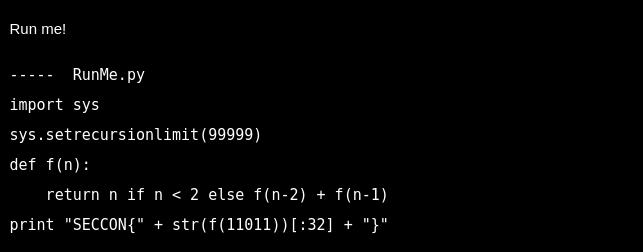

Bu koddaki fonksiyon, çok fazla tekrarlandığından hata veriyor. Bu yüzden kodu maksimum tekrarlanma derinliğini aşmadan yeniden yazmamız lazım.

``` python
m=0; n=1
for i in range(11010):
  temp = m; m = n; n += temp
print "SECCON{" + str(n)[:32] + "}"
```

**SECCON{65076140832331717667772761541872}**
