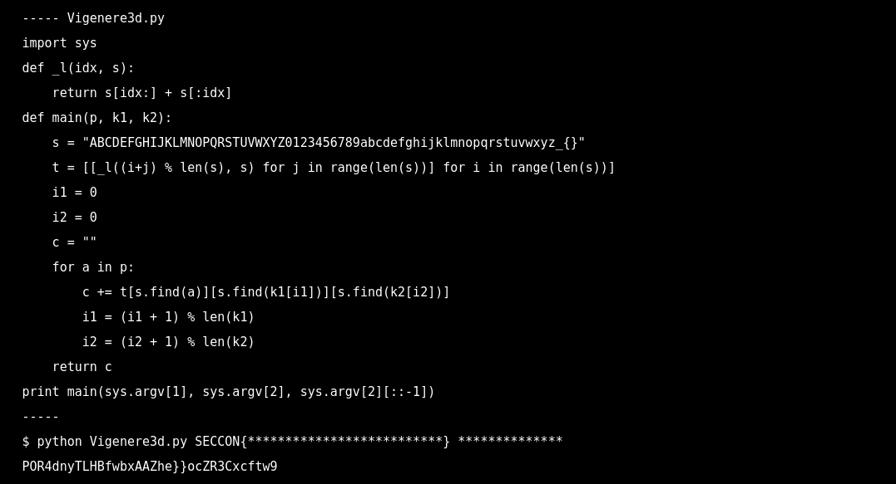
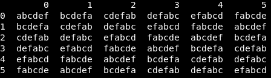
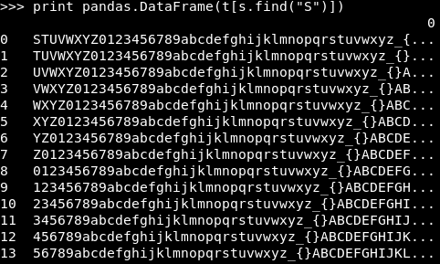

s yerine daha küçük bir string atayıp kodun ne yaptığını daha iyi görelim.
```python
def _l(idx, s):
    return s[idx:] + s[:idx]
s = "abcdef"
t = [[_l((i+j) % len(s), s) for j in range(len(s))] for i in range(len(s))]
```
s="abcdef" olduğunda, t matrisinin çıktısı:



Stringleri, satır ve sütun değerlerinin toplamının, stringin uzunluğuyla modu kadar döndürüyo. Bu bilgi bi kenarda dursun.

```python
print main(sys.argv[1], sys.argv[2], sys.argv[2][::-1])
```

Terminalden alınan iki argümandan, 1.si **p**, 2.si **k1** olarak alınıp, 2.sinin tersi de main fonksiyonuna **k2** olarak alınıp, for döngüsünün içine giriyo.

```python
for a in p:
        c += t[s.find(a)][s.find(k1[i1])][s.find(k2[i2])]
        i1 = (i1 + 1) % len(k1)
        i2 = (i2 + 1) % len(k2)
```

For döngüsünün içinde p'nin her bir elemanı için matristen bi eleman seçerek, şifreyi oluşturucak. Soruda bize **p**'nin **SECCON{** kısmı verilmiş, burdan **k1** hakkında bilgi çıkarabiliriz.



Matristeki herhangi bi elemanı incelediğimizde, arraydeki bi stringin sırasıyla, elemanın stringteki sırasının toplamının 65 modunda sabit olduğunu görüyoruz. **S**'nin matristen çıkan değeri **P**, 0. sıradaki stringte 62. sırada, 1. sıradaki stringte 61. sırada vs. 0+62=1+61 bu toplamlar 65 modunda hep sabit kalacak. O zaman,

_s.find(k1\[0\]) + s.find(k2\[0\]) = 62_

**k2**, **k1**'in tersi olduğu ve **k1**'in uzunluğu 14 olduğu için, aşağıdaki ilişkiyi çıkarabiliriz.

_s.find(k1\[0\]) + s.find(k1\[13\]) = 62_

```python
func = lambda x,y: t[s.find(x)][0].find(y)
print [func(x,"POR4dny"[i]) for i,x in enumerate("SECCON{")]
```
_\[62, 10, 15, 28, 25, 36, 62\]_

Yukarıdaki kodla, geriye kalan 6 toplamı elde ettik.

_s.find(k1\[1\]) + s.find(k1\[12\]) = 10_ <br/>
_s.find(k1\[2\]) + s.find(k1\[11\]) = 15_ <br/>
                  . <br/>
                  . <br/>
_s.find(k1\[6\]) + s.find(k1\[7\]) = 62_ <br/>

Bu 7 toplamla, geri kalan 7 toplamı da elde etmiş olduk.

_s.find(k1\[7\]) + s.find(k1\[6\]) = 62_ <br/>
_s.find(k1\[6\]) + s.find(k1\[7\]) = 36_ <br/>
                  . <br/>
                  . <br/>
_s.find(k1\[13\]) + s.find(k1\[0\]) = 62_

Artık bu bilgiyle bütün şifreyi ters çevirebiliriz.

```python
key = [62, 10, 15, 28, 25, 36, 62]
key = (key + key[::-1])*3
func = lambda x,y: s[s.find(x)-y]
print "".join([func(x,key[i]) for i,x in enumerate("POR4dnyTLHBfwbxAAZhe}}ocZR3Cxcftw9")])
```
**SECCON{Welc0me_to_SECCON_CTF_2017}**

func fonksiyonunda şifredeki elemanın normal yerinden şimdiki yerinin farkını bulduk, bu da bize stringin ne kadar kaydığını verdi, o da **p**'deki elemanın **s**'deki sırasını vermiş oldu.


                  


